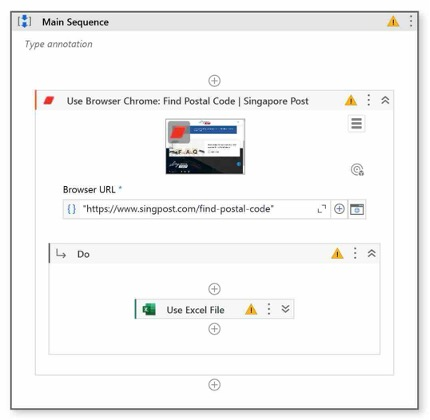
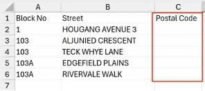
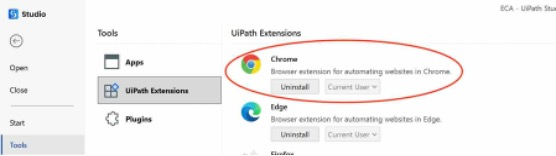
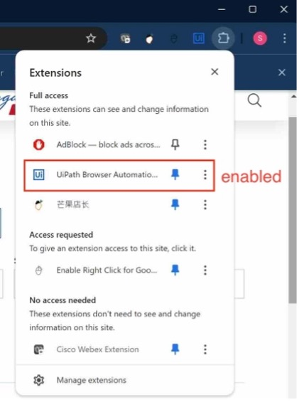
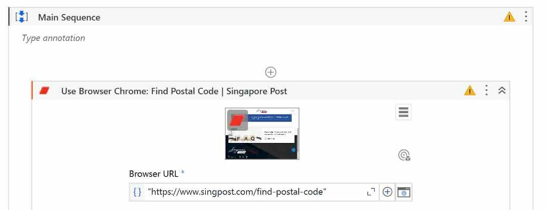
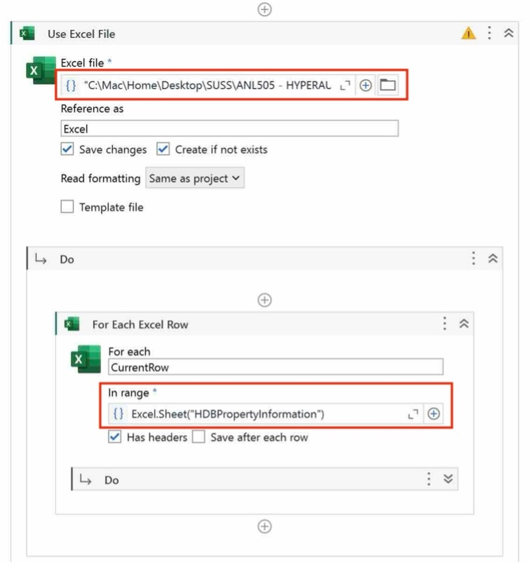
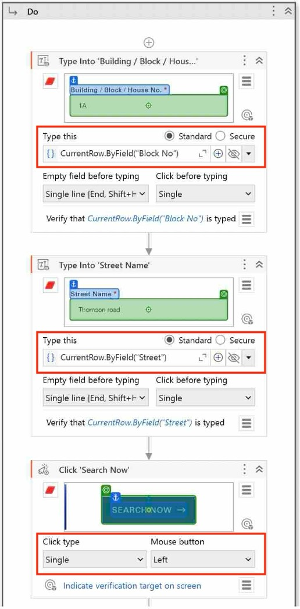
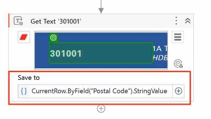
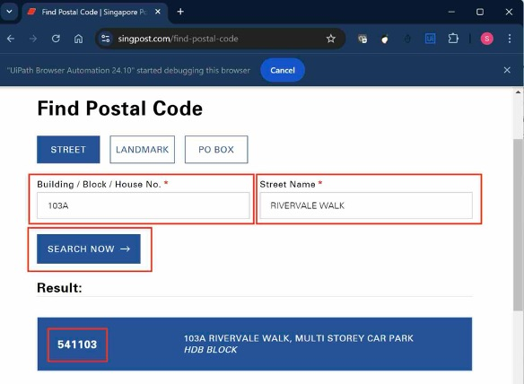

# Web Scraping Using UIPath

**Author**: Sally Marcellina Yeo  

Enterprise problem: Collecting postal codes for targeted market analysis.

Use case: Trigger to get postal code from a website using addresses in the excel file.

Initially the postal code column is empty. The workflow will automate the searching of postal code by automatically typing in the block and street information from the excel file into the website. Once postal code is generated, the value will be automatically added back into the excel file. This automation process greatly helps in reducing mundane task of searching postal code one by one manually. 

Below is the overall workflow using browser and excel.

The initial excel with empty postal codes:

We need to set up the UIPath in the Chrome web browser. Install the chrome extension in the UIPath Studio tools and enable the UiPath extension in the Chrome web browser.

 | 

Next, direct to the necessary browser URL to extract the postal code.

Use the excel file to get the data source by specifying the file location and the range of the file so that the column can be selected in the next workflow.

Lastly the input activities contain 3 steps:
1.	Type into the ‘Building/Block/House No.’ using the value in the “Block No” column of the excel file.
2.	Type into the ‘Street Name’ using the value in the “Street” column of the excel file.
3.	Click ‘Search Now’ on the website.

Once the postal code is generated, Get Text will be used as the output activity to save the postal code into the excel file.

Following screenshot shows that the form is auto filled with values extracted from the excel file. The Search Now button is auto clicked, and the postal code is generated and auto saved into excel file.

 | 
